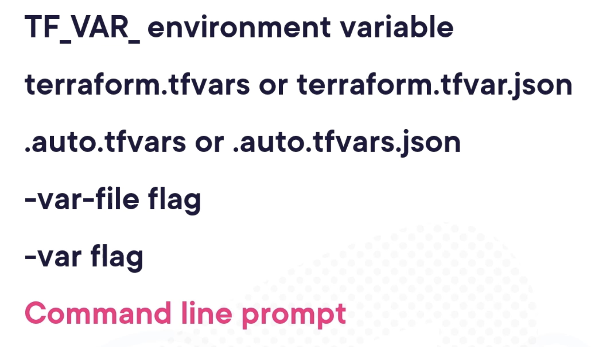

### Course materials

- https://github.com/ned1313/Deep-Dive-Terraform/tree/main

# Terraform Study Notes

- TF is idempotent -- applying the same config multiple times will not change the outcome.

variable "name_label" {
    type = value
    description = "string"
    default = value
    sensitive = true | false
    ...
}

referencing collection values:
var.<name_label>.<key_name> or   var.<name_label>["key_name"]



## Interacting with Terraform State Data

- terraform refresh (deprecated)
- terraform plan/apply -refresh-only
- terraform taint ADDR
- terraform plan/apply -replace="ADDR"
- terraform state mv OLD_ADDR NEW_ADDR (deprecated)
- moved {
    from = OLD_ADDR
    to = NEW_ADDR
}
- terraform state rm ADDR
- terraform state list
- terraform state show ADDR
- terraform state pull
- terraform state push PATH

- terraform init -backend-config="bucket=xyz"
- terraform init -backend-config="backend-settings.txt"


Terraform Automation Env Vars
- TF_IN_AUTOMATION = TRUE
- TF_LOG = "INFO"
- TF_LOG_PROVIDER = "ERROR"
- TF_LOG_PATH = "FILEPATH"
- TF_INPUT = FALSE
- TF_VAR_name = "VALUE"
- TF_CLI_ARGS = "COMMAND FLAGS"

## GitHub Actions Workflow
- in a job: `if: (success() || failure())` --> job runs regardless whether previous job succeeds or fails

## Common Approaches to multiple environments

- terraform OS workspaces
- directories & TF files
- branches or release tags
- separate repositories


- `ssh -i ~/.ssh/rsa_ private_key.pem user@PUBLIC_IP_ADDRESS`

## Implementing Configuration Management


### configuration mgmt concepts:

- identification: what to manage
- control: how to manage
- accounting: how to report
- verification: how to validate

### factors of consideration

- TF hand-off: i.e. TF invokes config mgmt tool with startup script, or triggered by CI/CD, or discovery
- push or pull: centralized server pushes to each node in inventory (ex: ansible), or each node pulls from a central repo with config (ex: puppet)
- centralized or distributed: centralized config mgmt that usually pushes, or stored in shared distributed repo that doesn't force a cadence. Distributed is more scalable bc no bottleneck of centralized server, but loses centralized logging.

- **traditional deployment**: create image --> deploy instance --> provision application --> config mgmt
- **immutable deployment** (once deployed can't change): create image --> deploy instance  --> update image --> deploy update (ex: rolling upgrade)

## TF Null & Data Resource

- null resource (deprecated) exists to run provisioners outside of lifecycle of a specific resource -- commonly to perform a task that doesn't have a provider (ex: running script to update config or bootstrap cluster)

- data sources don't create external resources
- instead, creation/replacement triggered by other resources in config by specifying the triggers_replace arg and list of values to trigger on:

```
resource "terraform_data" "example" {
    triggers_replace = [
        # Watch list of instance IDs
        join(",", aws_instance.ain.*.id)
    ]
}
```
^ changes kicks off any provisioners inside of block

- can also store arbitrary info in TF state with `input` arg -- can be used with `replace_triggered_by` arg in another resource to trigger its replacement based on that value.

## Module 9: Dealing with Sensitive Data

- also includes, iPs, host names, DB ports

#### In TF State

- resources, data sources, outputs
- state should be encryted at rest & transit